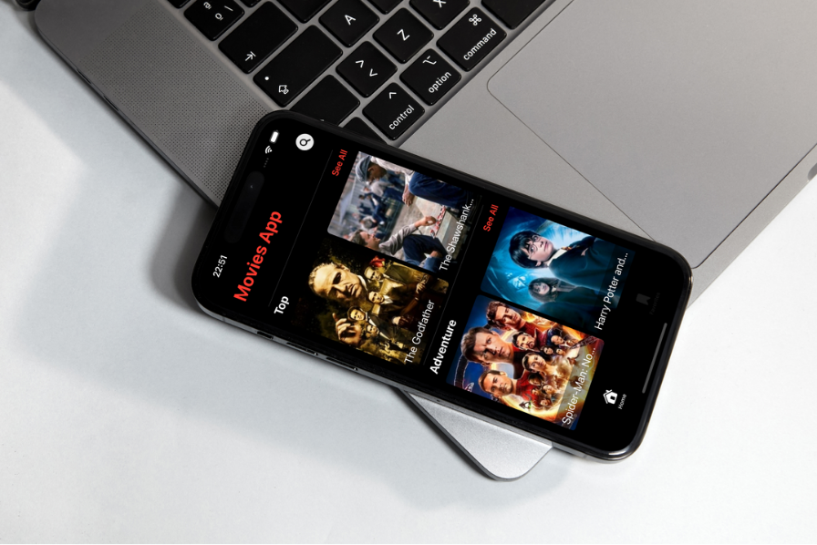

# practice-movies-app

## About
It is an iOS app where users can review movies according to categories, genres, new and upcoming movies. Also users can search any movie and can add movies to favorites. In movie detail view, can access trailer on youtube and web page of imdb.
In addition, detail view includes overview and actors of movie.

## Features
- User can review movies according to categories on the home view.
- User can search any movie. If the user doesn't type for 1 second after entering at least 3 characters, request is sent to the API.
- User can add movies to favorites. Stored in UserDefaults.
- Project includes a generic network layer with URLSession.

## Keywords
- SwiftUI
- MVVM
- TMDB API
- Generic Network Layer with URLSession
- Kingfisher
- UserDefaults

## App Views
| Home View | Search View | Favorites View |
|---|---|---|
||||
